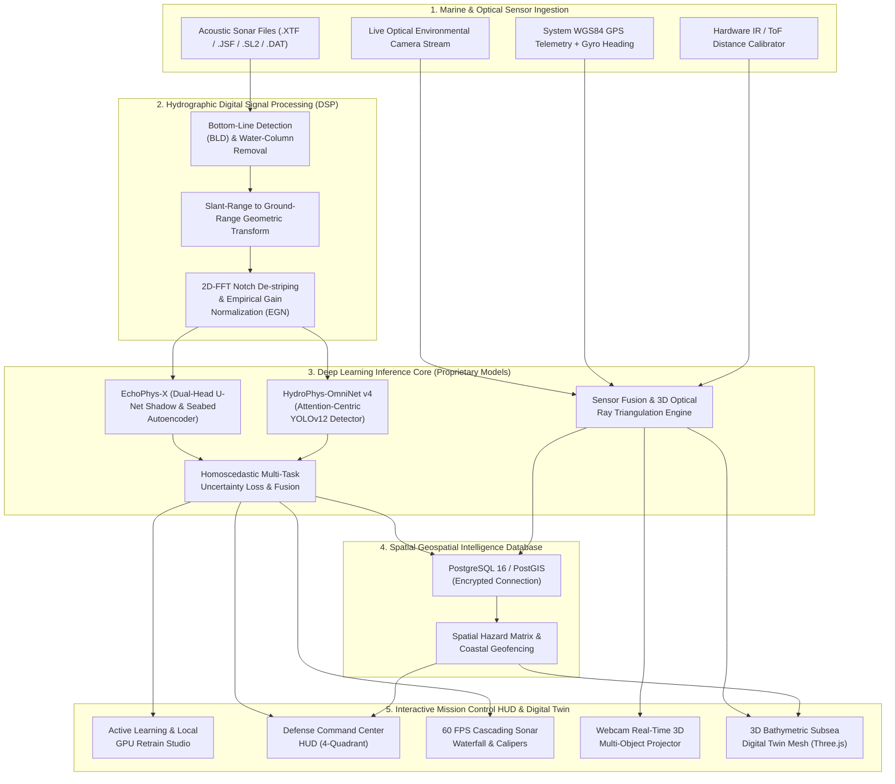

# 🌊 EchoPulseNet: Deep Ocean Sonar Intelligence & Defense-Grade Marine Digital Twin Platform

[](https://github.com/ELANGKATHIR11/ECHO-PULSE)
[](https://pytorch.org/)
[](https://github.com/ELANGKATHIR11/ECHO-PULSE)
[](https://react.dev/)
[](https://fastapi.tiangolo.com/)
[](https://postgis.net/)
[](LICENSE)

**EchoPulseNet** is an offline-capable, 100% native edge marine intelligence system designed for real-time acoustic target detection, autonomous underwater vehicle (AUV/ROV) hydrographic surveys, interactive 3D bathymetric Digital Twin visualization, system GPS & IR distance sensor fusion, and active learning annotation.

Built for **Smart India Hackathon (SIH 2026)** under Problem Statement **ID: 26057** (*AI-Powered Automated Underwater Marine Debris and Anomaly Detection System using Side-Scan Sonar Imagery*) for the **Ministry of Earth Sciences (MoES) / National Institute of Ocean Technology (NIOT)**.

---

## 🏛️ System Architecture & Dataflow Diagram



---

## 📦 Project Packages & Dependencies Inventory

### 💻 Client & Frontend Stack (`package.json`)
| Package | Version | Purpose |
| :--- | :--- | :--- |
| **react** / **react-dom** | `^19.0.1` | High-performance reactive mission control UI |
| **three** | `^0.185.1` | WebGL 3D Bathymetric Digital Twin rendering engine |
| **@react-three/fiber** | `^9.7.0` | Declarative React wrapper for Three.js scene management |
| **@react-three/drei** | `^10.7.8` | Advanced 3D camera controls, shaders, and ocean environment helpers |
| **leaflet** / **react-leaflet** | `^1.9.4` / `^5.0.0` | GIS mapping for Marine Protected Areas (MPA) & debris geotags |
| **@tensorflow/tfjs** | `^4.22.0` | Web-native edge optical camera object tracking |
| **@tensorflow-models/coco-ssd** | `^2.2.3` | Optical detection backbone for ray-cast 3D triangulation |
| **motion** (Framer Motion) | `^12.23.24` | Ultra-smooth telemetry HUD animations and transitions |
| **lucide-react** | `^0.546.0` | High-tech tactical military/oceanographic HUD iconography |
| **tailwindcss** | `^4.1.14` | Styling framework for responsive tactical dark-mode dashboard |
| **vite** | `^6.2.3` | Next-generation ultra-fast frontend build engine |
| **electron** / **electron-builder** | `^43.4.1` / `^26.15.3` | Standalone cross-platform desktop application packaging |
| **@tauri-apps/cli** | `^1.5` | Native Rust-backed ultra-lightweight edge desktop shell |

### 🐍 Backend & AI Engine Stack (`backend/requirements.txt`)
| Package | Version | Purpose |
| :--- | :--- | :--- |
| **fastapi** | `>=0.115.0` | Asynchronous REST and WebSocket API gateway |
| **uvicorn[standard]** | `>=0.30.0` | Lightning-fast ASGI production web server |
| **torch** / **torchvision** | `>=2.1.0` / `>=0.16.0` | PyTorch GPU deep learning computation & tensor physics |
| **ultralytics** | `>=8.3.0` | SOTA YOLOv12 acoustic anomaly detection backbone |
| **opencv-python-headless** | `>=4.8.0` | Computer vision, 2D-FFT filtering, and sonar image slicing |
| **scipy** / **numpy** | `>=1.11.0` / `>=1.24.0` | Hydrographic DSP, slant-range transform & signal normalization |
| **scikit-learn** | `>=1.3.0` | Spatial clustering, density metrics & active learning triage |
| **pandas** | `>=2.0.0` | Survey mission telemetry time-series & spatial analytics |
| **SQLAlchemy** / **psycopg2-binary** | `>=2.0.0` / `>=2.9.9` | High-throughput PostgreSQL database pooling & ORM |
| **GeoAlchemy2** / **shapely** | `>=0.14.0` / `>=2.0.0` | PostGIS spatial geometry indexing, geofencing & distance calculations |
| **cryptography** | `>=42.0.0` | Fernet symmetric credential encryption for defense-grade security |
| **pydantic** / **python-multipart** | `>=2.0.0` / `>=0.0.9` | Request validation & large acoustic sonar file ingestion |
| **pytest** | `>=8.0.0` | Automated backend testing suite |

---

## ✨ Key Capabilities

* **⚡ Native Edge Execution:** Zero cloud API dependencies; runs fully on local hardware accelerated by **NVIDIA CUDA** (RTX 5060 Laptop GPU) and **WebGPU**.
* **🎯 HydroPhys-OmniNet v4 Deep Learning Core:** Multi-task marine detector with homoscedastic uncertainty loss balancing detection ($\mathcal{L}_{\text{det}}$), shadow segmentation ($\mathcal{L}_{\text{shadow}}$), and bathymetric depth ($\mathcal{L}_{\text{depth}}$).
* **🌊 Hydrographic Digital Signal Processing (DSP):**
  * Automated Bottom-Line Detection (BLD) tracking water-column altitude.
  * Slant-Range to Ground-Range geometric correction ($Y_{\text{ground}} = \sqrt{R_{\text{slant}}^2 - H_{\text{alt}}^2}$).
  * 2D-FFT frequency domain notch filtering eliminating vessel thruster reverberation.
  * Time-Varied Gain (TVG) and Empirical Gain Normalization (EGN).
* **🌐 3D Subsea Digital Twin (Multi-Object Projection):**
  * Interactive Three.js seabed mesh rendering **multiple simultaneous objects in parallel**.
  * Real-time projection from **Webcam Streams + System GPS + IR Distance Sensor** into 3D glowing beacons with vertical laser guidance pins.
* **🎛️ Defense Command Center HUD (`/command-center`):** Synchronized 4-quadrant mission control featuring live Sonar Waterfall, 3D Digital Twin, PostGIS Spatial Hazard Matrix, and Target Lock HUD.
* **🔊 Subsea Acoustic Audio Synthesizer:** Authentic frequency-modulated underwater submarine chirp audio via Web Audio API.
* **🧠 Human-in-the-Loop Active Learning:** Triage queue for high-uncertainty detections with 1-click local GPU fine-tuning.

---

## 🚀 Quick Start Guide

### 1. Prerequisites
* **Node.js** v18+ & **npm**
* **Python** 3.10+ (with CUDA 12.x recommended for GPU acceleration)
* **PostgreSQL / PostGIS** (Optional for cloud GIS clustering)

### 2. Backend Setup
```bash
cd backend
pip install -r requirements.txt
python -m uvicorn app.main:app --host 127.0.0.1 --port 8000
```
API documentation available at: `http://127.0.0.1:8000/api/v1/docs`

### 3. Frontend Setup
```bash
# In the root directory
npm install
npm run dev
```
Open your browser at `http://localhost:3000/`

---

## 📊 Marine Sonar Taxonomy

| Class ID | Target Classification | Typical Acoustic Signature | Threat Level |
| :--- | :--- | :--- | :--- |
| `0` | **Derelict Ghost Gear & Net** | Diffuse acoustic backscatter with irregular trailing shadow | 🔴 CRITICAL |
| `1` | **Shipwreck / Submerged Hull** | High-backscatter metallic highlight + elongated hull shadow | 🟠 HIGH |
| `2` | **Unexploded Ordnance (UXO)** | Compact high-intensity target with geometric cylindrical shadow | 🔴 CRITICAL |
| `3` | **Pipeline Scour / Anomaly** | Linear corridor with free-span depth deviations | 🟠 HIGH |
| `4` | **Marine Anthropogenic Debris**| High acoustic reflectivity clustered anomalies | 🟡 MEDIUM |
| `5` | **Subsea Power & Data Cable** | Continuous linear seabed depression/trench | 🟠 HIGH |
| `6` | **Benthic Biological Cluster** | Low-contrast porous acoustic return (coral reefs) | 🟢 LOW |
| `7` | **Geological Outcrop / Ridge** | Broad acoustic backscatter with terrain relief | 🟢 LOW |

---

## 📜 Dual Licensing

This repository is governed by a **Dual Licensing Model**:

1. **Open Platform Components ([GNU General Public License v3.0 (GPLv3)](LICENSE))**:
   * The web application, UI/UX components, Three.js 3D viewers, DSP sonar processors, and REST APIs are licensed under the **GNU GPL v3.0**.
2. **Proprietary Deep Learning Models ([MODELS_LICENSE.md](MODELS_LICENSE.md))**:
   * The **HydroPhys-OmniNet v4** and **EchoPhys-X** neural architectures, custom mathematical loss formulations, and trained `.pt` weight checkpoints are proprietary intellectual property covered under the **Private Model License**.

