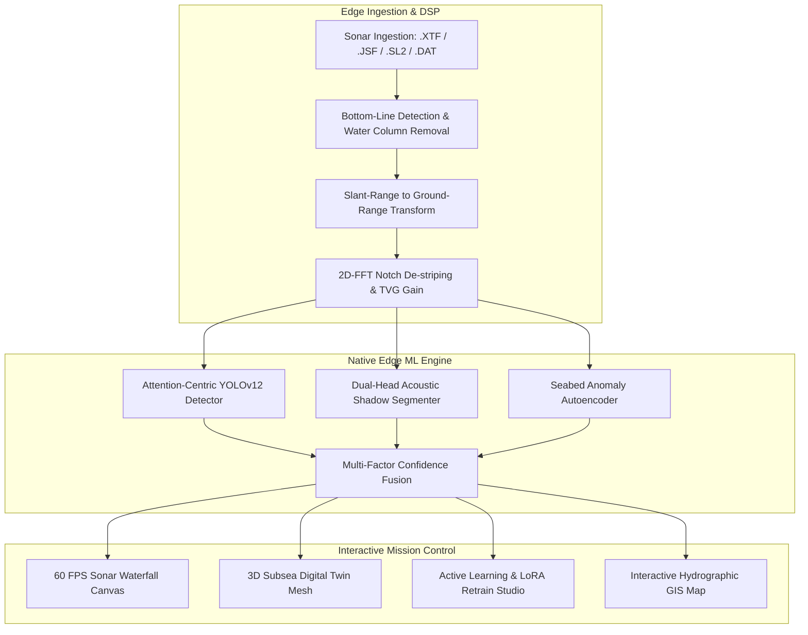

# 🌊 EchoPulseNet: Deep Ocean Sonar Intelligence & Native Edge Platform

[](https://github.com/ELANGKATHIR11/ECHO-PULSE)
[](https://pytorch.org/)
[](https://github.com/ELANGKATHIR11/ECHO-PULSE)
[](https://react.dev/)
[](https://fastapi.tiangolo.com/)

**EchoPulseNet** is an offline-capable, 100% native edge marine intelligence system designed for real-time acoustic target detection, autonomous underwater vehicle (AUV/ROV) hydrographic surveys, interactive 3D bathymetric Digital Twin visualization, and Active Learning annotation.

---

## 🏛️ System Architecture



---

## ✨ Key Capabilities

* **⚡ Native Edge Execution:** Zero cloud API dependencies; runs fully on local hardware accelerated by **NVIDIA CUDA** and **WebGPU**.
* **🎯 Attention-Centric YOLOv12:** Custom-trained multi-class marine detector ($A2C2f$ area-attention) for shipwrecks, ghost gear, subsea pipelines, UXOs, marine debris, and geological outcrops.
* **🌊 Hydrographic Digital Signal Processing (DSP):**
  * Automated Bottom-Line Detection (BLD) tracking water-column altitude.
  * Slant-Range to Ground-Range geometric correction ($Y_{ground} = \sqrt{R_{slant}^2 - H_{alt}^2}$).
  * 2D-FFT frequency domain notch filtering eliminating vessel thruster reverberation.
  * Time-Varied Gain (TVG) and Empirical Gain Normalization (EGN).
* **🌐 3D Subsea Digital Twin:** Interactive Three.js seabed mesh with dynamic AUV acoustic fan beam projection and pipeline stress visualization.
* **🎛️ 60 FPS Sonar Waterfall Canvas:** 6 authentic hydrographic colormaps (*Amber Phosphor, Deep Cobalt, Viridis, Sepia, Jet, Greyscale*) + Caliper Shadow Height Measurement Tool HUD.
* **🧠 Human-in-the-Loop Active Learning:** Triage queue for high-uncertainty detections with 1-click local GPU fine-tuning.

---

## 🚀 Quick Start Guide

### 1. Prerequisites
* **Node.js** v18+ & **npm**
* **Python** 3.10+ (with CUDA 12.x recommended for GPU acceleration)

### 2. Backend Setup
```bash
cd backend
pip install -r requirements.txt # or install fastapi uvicorn torch opencv-python ultralytics
python -m uvicorn app.main:app --host 127.0.0.1 --port 8000
```
Backend Swagger API documentation will be available at: `http://127.0.0.1:8000/api/v1/docs`

### 3. Frontend Setup
```bash
# In the root directory
npm install
npm run dev
```
Open your browser at `http://localhost:3000/`

---

## 📊 Model Taxonomy

| Class ID | Target Classification | Typical Acoustic Signature |
| :--- | :--- | :--- |
| `0` | **Derelict Ghost Gear & Net** | Diffuse acoustic backscatter with irregular trailing shadow |
| `1` | **Shipwreck / Submerged Hull** | High-backscatter metallic highlight + elongated hull shadow |
| `2` | **Unexploded Ordnance (UXO)** | Compact high-intensity target with geometric cylindrical shadow |
| `3` | **Pipeline Scour / Anomaly** | Linear corridor with free-span depth deviations |
| `4` | **Marine Anthropogenic Debris**| High acoustic reflectivity clustered anomalies |
| `5` | **Subsea Power & Data Cable** | Continuous linear seabed depression/trench |
| `6` | **Benthic Biological Cluster** | Low-contrast porous acoustic return (coral reefs) |
| `7` | **Geological Outcrop / Ridge** | Broad acoustic backscatter with terrain relief |

---

## 📜 License
Licensed under the [MIT License](LICENSE).
